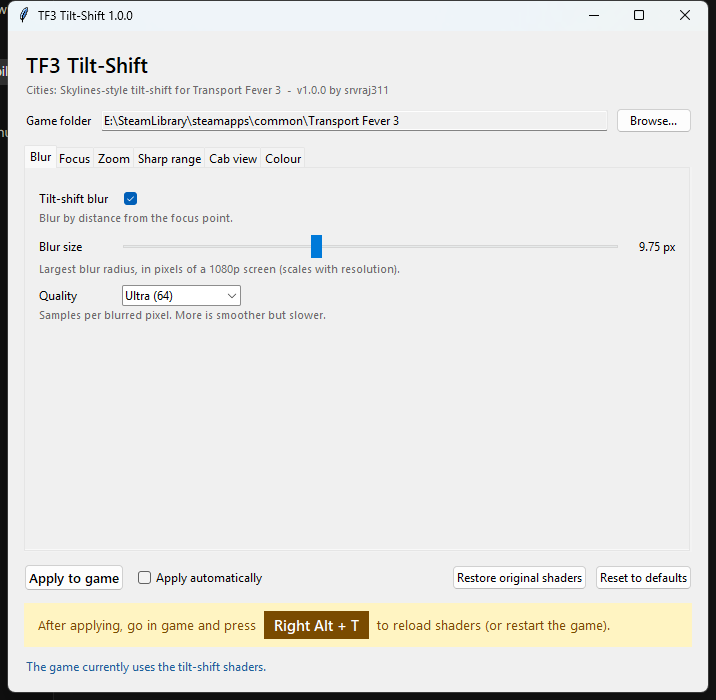

# TF3 Tilt-Shift

A Cities: Skylines-style **tilt-shift / depth-of-field** look for **Transport Fever 3**, with a small settings app.

The focus point is found automatically and prefers the nearest object, such as the train you follow. Things in front of or
behind it blur more the further they are from it. The sharp range follows the zoom, and a slight colour boost gives the
"photographed model" feel. By [srvraj311](https://github.com/srvraj311).

**[Download TF3TiltShift.exe](../../releases/latest/download/TF3TiltShift.exe)**: one file, no install, Windows only.



## Use

1. Download `TF3TiltShift.exe` from the [latest release](../../releases/latest) and run it. No install is needed.
   Windows SmartScreen may warn about an unsigned app: choose **More info > Run anyway**.
2. It finds Transport Fever 3 in your Steam libraries. If it doesn't, use **Browse...** to pick the game folder.
3. Adjust the settings if you like, then press **Apply to game**.
4. In game, press **Right Alt + T** to reload shaders, or just start the game.

**Restore original shaders** puts the game's own files back. **Reset to defaults** returns every slider to the default
look. Turn on **Apply automatically** to see changes live: move a slider, then press Right Alt + T in game.

Settings are saved to `%APPDATA%\srvraj311\TF3TiltShift\settings.json`.

| Tab | Settings |
|---|---|
| Blur | on/off, blur size, quality (samples per pixel) |
| Focus | where the focus is measured, the size of that area, how strongly near objects win it |
| Zoom | the distances counted as "close up" and "zoomed out", and the strength at each |
| Sharp range | how far in front of and behind the focus stays sharp, and how gradually blur builds up, for close-up and zoomed-out views |
| Cab view | keep the lower screen sharp when the camera looks level and close (cab view) |
| Colour | colour boost on/off, saturation, contrast |

## Good to know

- **It is not a Mod Hub mod.** TF3 loads its shaders only from its own install folder, and a mod folder cannot replace
  them, which was tested in game. The app edits two of the game's post-process shaders instead:
  `base/content/rendering/programs/shaders/hdr/compose.fs` and `.../misc/ssr_apply.fs`. Each original is kept beside
  it as `*.tiltshift_orig`.
- **Game updates and Steam "Verify integrity"** put the original shaders back. Open the app and press **Apply to game**
  again. If an update changed those shaders in a way the app doesn't know, it refuses to apply and says so, instead of
  writing a broken shader.
- **Works with screen-space reflections on or off.** Menus and other UI are never blurred.
- **Other shader tweaks** that edit the same two files will conflict.
- **No game code is shipped.** The app contains only its own GLSL snippets. It reads your installed game's shaders and
  patches them on your PC.
- **Motion blur isn't possible.** The engine gives these shaders no motion data and no memory of earlier frames.

## How it works

- `ssr_apply.fs`, a full-screen pass that has the depth buffer: the game's `main()` is renamed `ssrMain()`, and our
  `main()` runs it, then blurs.
  - **Focus**: a near-weighted average distance over 63 points in a patch just below the screen centre, ignoring sky.
    It stays steady when a pole or wire passes through.
  - **Blur amount**: by distance only, as `log2(distance / focus)`, so it scales with the zoom. There are separate near
    and far ranges, like CS2's Near/Far Start/End, blended between close-up and zoomed-out values.
  - **Gather**: 48 taps at fixed screen offsets, so nothing shimmers while the blur changes. Taps sharper than the pixel
    are ignored, so there are no halos around sharp objects.
- `compose.fs`, the final tone-mapping pass: the colour boost.

The defaults are the `const` values in [tiltshift/glsl/](tiltshift/glsl/). The app rewrites those values from its
settings.

## For developers

Plain Python 3.10+ with the standard library only (Tkinter for the window). Windows only, because it reads the Steam
registry key and patches a Windows game install.

```
python -m tiltshift                          # the app
python -m tiltshift apply | restore | probe  # without the window; probe = coloured test to check the shaders still load
python -m unittest discover -s tests -t .    # tests (no game needed)
python -m pip install pyinstaller
python tools/build_exe.py                    # -> dist/TF3TiltShift.exe (one file, no console)
```

### Layout

| Path | What it does |
|---|---|
| [tiltshift/glsl/ssr_tiltshift.glsl](tiltshift/glsl/ssr_tiltshift.glsl) | The tilt-shift: focus detection, blur amount and gather. Appended to `ssr_apply.fs`. |
| [tiltshift/glsl/compose_grade.glsl](tiltshift/glsl/compose_grade.glsl) | The colour boost, inserted into `compose.fs`. |
| [tiltshift/glsl/ssr_probe.glsl](tiltshift/glsl/ssr_probe.glsl) | Diagnostic tint used by `probe`. |
| [tiltshift/shaders.py](tiltshift/shaders.py) | Pure text work: takes the game's original shader and the settings and returns the patched shader. Every anchor must match exactly once, or it raises `PatchError`. |
| [tiltshift/game.py](tiltshift/game.py) | Disk work: finds TF3 through Steam's `libraryfolders.vdf`, writes patched files, keeps `*.tiltshift_orig` backups and restores them. |
| [tiltshift/settings.py](tiltshift/settings.py) | The list of settings (label, tab, range, help text) and saving them to `%APPDATA%`. |
| [tiltshift/app.py](tiltshift/app.py) | The Tkinter window, built from that list. |
| [tiltshift/\_\_main\_\_.py](tiltshift/__main__.py) | Entry point: the window, or the `apply` / `restore` / `probe` commands. |
| [tools/build_exe.py](tools/build_exe.py) | PyInstaller build with the GLSL files bundled and Windows version info. |
| [tests/](tests/) | Unit tests against a fake game folder. |

### Flow of an Apply

1. `settings` gives `{name: value}` for every setting.
2. `game.original_text()` reads the live shader. If it has no `srvraj311_tiltshift` marker, it is the game's original
   and is copied to the backup. If it does, the backup is read instead, so patches never stack.
3. `shaders.patch_*()` replaces the `const TS_...` values in the snippet and splices it into the original.
4. Both files are built before either is written, so a failed patch leaves the game untouched.

### Adding a setting

1. Add `const float TS_MY_VALUE = 1.0;` (or `int`) to a snippet in `tiltshift/glsl/` and use it in the shader. That
   value is the default.
2. Add a `Setting("TS_MY_VALUE", ...)` line to `SETTINGS` in [settings.py](tiltshift/settings.py) with its tab, range
   and help text. The window and saving pick it up without more code.

### When a game update changes the shaders

Apply fails with a `PatchError` that names the anchor it could not find. Look at the new `compose.fs` / `ssr_apply.fs`
in the game folder, update the anchors in [shaders.py](tiltshift/shaders.py) and the fake shaders in the tests, then
check in game with `python -m tiltshift probe`.

### Releasing

Bump `__version__` in [tiltshift/\_\_init\_\_.py](tiltshift/__init__.py), commit, then push a matching tag:

```
git tag v1.0.1
git push origin v1.0.1
```

The [Release workflow](.github/workflows/release.yml) runs the tests on Windows, builds `TF3TiltShift.exe` and attaches
it to a GitHub Release. It can also be started by hand from the Actions tab; that build is kept as a workflow artifact.

## Licence

MIT, see [LICENSE](LICENSE). Transport Fever 3 and its shaders belong to Urban Games; this project ships none of them.
